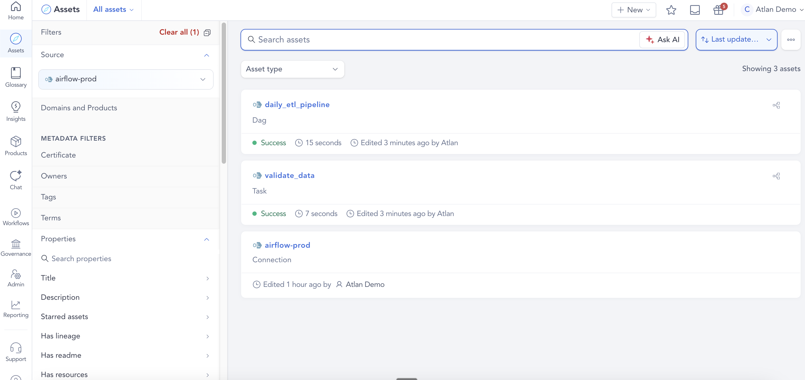
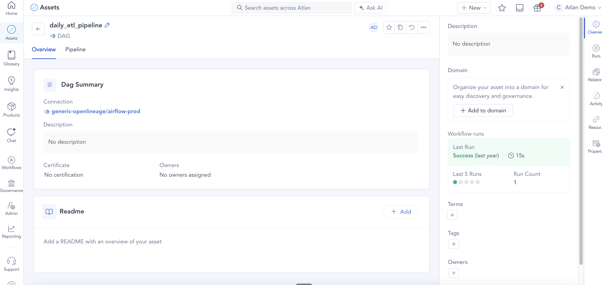
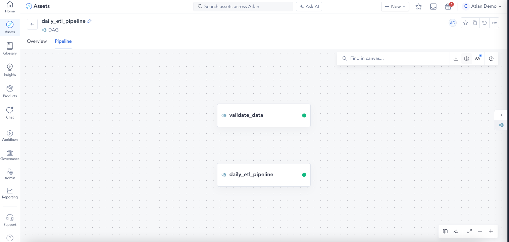

# Example 01: Simple DAG (no I/O)

Demonstrates basic FlowControlOperation creation with a parent DAG and a single child task. No input/output datasets — just job execution tracking.

## What this sends

| File | eventType | Job | Level |
|------|-----------|-----|-------|
| `01_dag_start.json` | START | `daily_etl_pipeline` | DAG (parent) |
| `02_task_start.json` | START | `daily_etl_pipeline.validate_data` | TASK (child) |
| `03_task_complete.json` | COMPLETE | `daily_etl_pipeline.validate_data` | TASK (child) |
| `04_dag_complete.json` | COMPLETE | `daily_etl_pipeline` | DAG (parent) |

## What appears in Atlan

- **1 DAG**: `daily_etl_pipeline` with status Success
- **1 Task**: `validate_data` nested under the parent, with status Success

No Process or lineage assets are created because there are no input/output datasets.

## Key fields

- `job.facets.jobType.jobType: "DAG"` marks the parent event
- `run.facets.parent` in the task events links them to the parent DAG run
- `job.name` for the child follows the convention `<dag-name>.<task-name>`

## How it looks in Atlan


*Asset list — DAG, Task, and Connection*
<br>


*DAG overview with workflow run summary*
<br>

*Pipeline view — validate_data task nested under daily_etl_pipeline*

## Run it

```bash
python send_events.py examples/01_simple_dag
```

