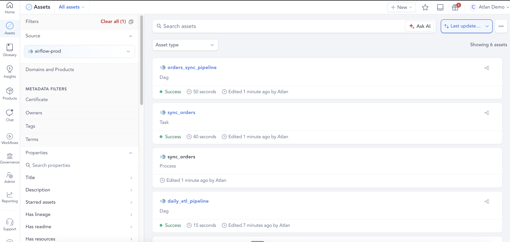
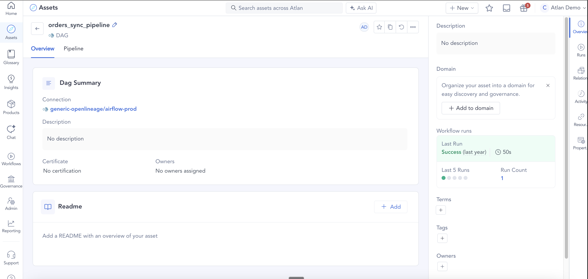
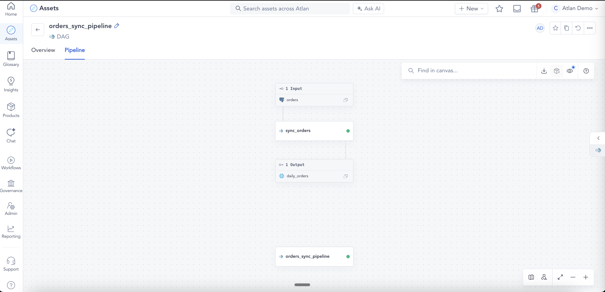
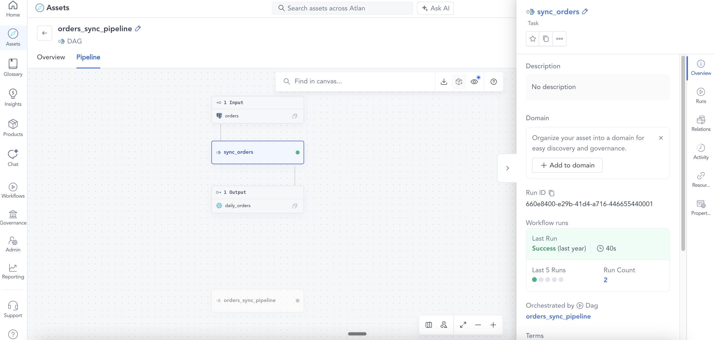

# Example 02: DAG with table lineage

Demonstrates Process asset creation and dataset lineage. A single task reads from a Postgres table and writes to a Snowflake table, with a schema facet on the output.

## What this sends

| File | eventType | Job | Datasets |
|------|-----------|-----|----------|
| `01_dag_start.json` | START | `orders_sync_pipeline` | — |
| `02_task_start.json` | START | `orders_sync_pipeline.sync_orders` | — |
| `03_task_complete.json` | COMPLETE | `orders_sync_pipeline.sync_orders` | Postgres input + Snowflake output |
| `04_dag_complete.json` | COMPLETE | `orders_sync_pipeline` | — |

## What appears in Atlan

- **1 parent FlowControlOperation**: `orders_sync_pipeline`
- **1 child FlowControlOperation**: `sync_orders`
- **1 Process**: linking input to output
- **Postgres table** (partial asset): `sales.public.orders`
- **Snowflake table** (partial asset): `analytics.reporting.daily_orders` — with columns `order_id`, `customer_id`, `amount`, `order_date`
- **Lineage edge**: Postgres → Snowflake via the Process

## Key fields

- `inputs[].namespace` uses the JDBC URL form `postgresql://db.internal:5432` — the connector maps this to a Postgres connection
- `outputs[].facets.schema` carries the column definitions — these become Column assets on the Snowflake table
- Inputs/outputs only need to be present on the COMPLETE event (the connector uses the terminal event for lineage)

## How it looks in Atlan


*Asset list — DAG, Task, and Process assets created*
<br>


*DAG overview with workflow run summary*
<br>


*Pipeline view — lineage from Postgres orders to Snowflake daily_orders via sync_orders*
<br>


*sync_orders task detail — run ID, last run status, and parent DAG*
<br>

## Run it

```bash
python send_events.py examples/02_dag_with_lineage
```
