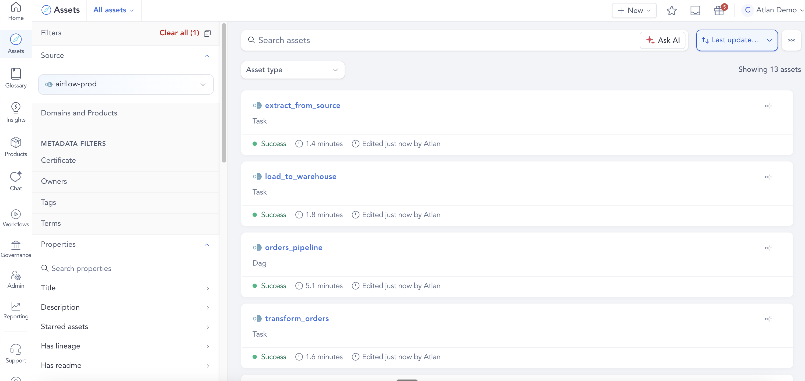
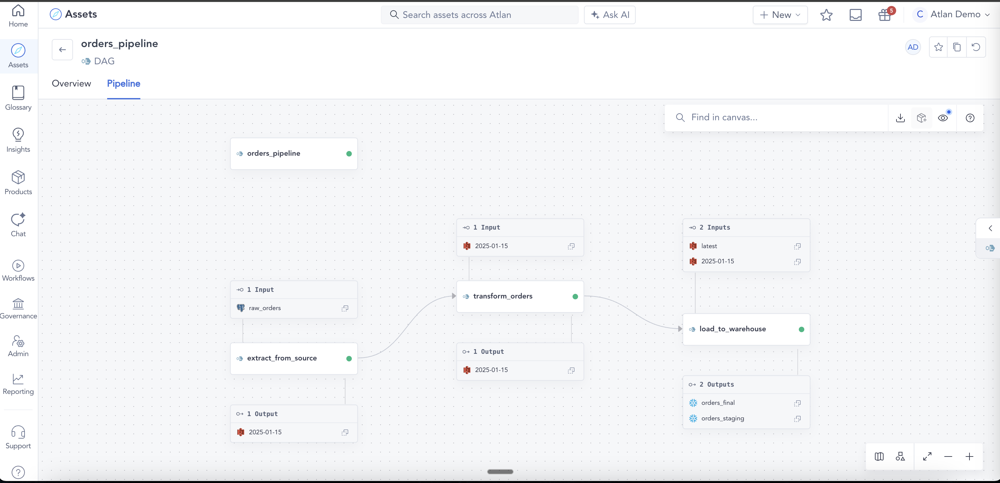
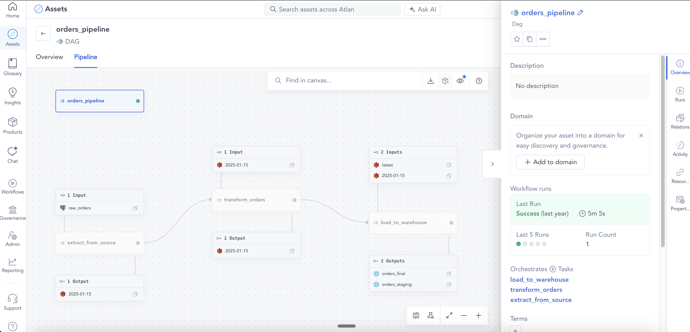
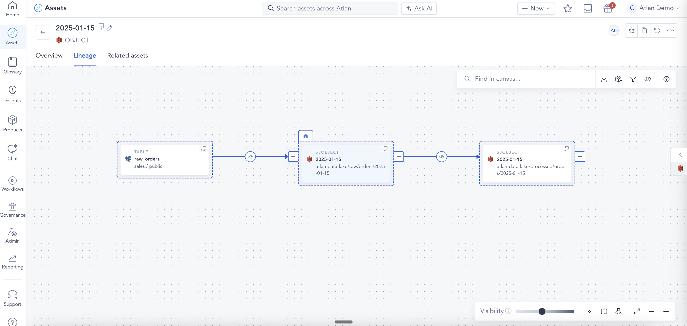
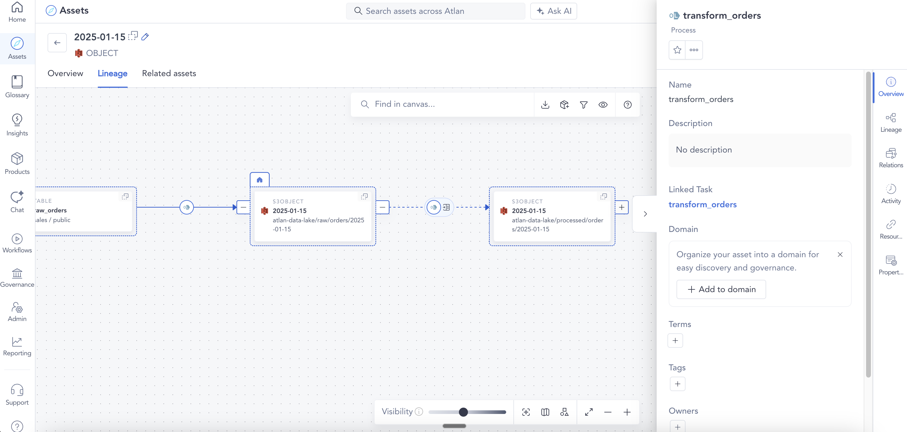
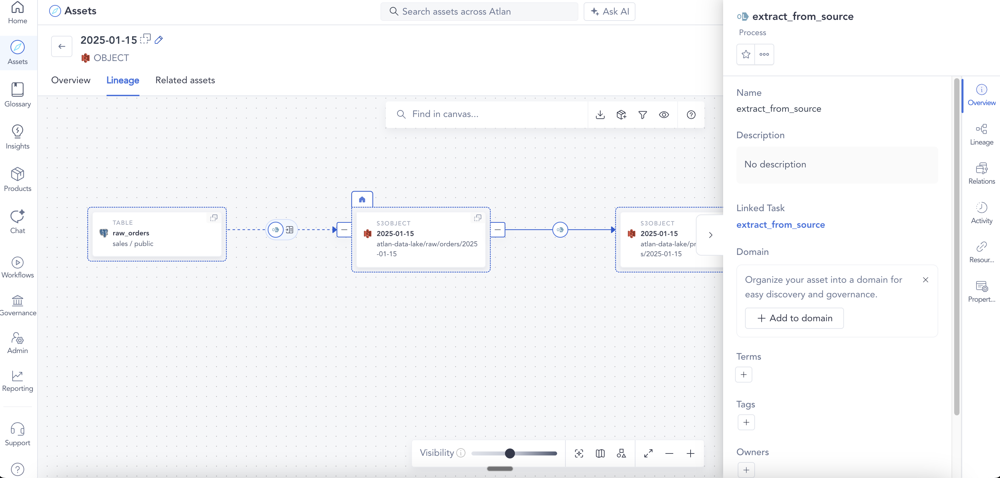

# Example 03: Multi-task DAG

Demonstrates a DAG with three sequential tasks, each producing a Process and a lineage edge. The full chain is: Postgres → S3 (raw) → S3 (processed) → Snowflake. Also demonstrates inter-task lineage and input/output merging across START and COMPLETE events.

## What this sends

| File | eventType | Job | Datasets |
|------|-----------|-----|----------|
| `01_dag_start.json` | START | `orders_pipeline` | — |
| `02_task1_start.json` | START | `orders_pipeline.extract_from_source` | Postgres input → S3 raw output |
| `03_task1_complete.json` | COMPLETE | `orders_pipeline.extract_from_source` | — |
| `04_task2_start.json` | START | `orders_pipeline.transform_orders` | — |
| `05_task2_complete.json` | COMPLETE | `orders_pipeline.transform_orders` | S3 raw input → S3 processed output |
| `06_task3_start.json` | START | `orders_pipeline.load_to_warehouse` | S3 processed input → Snowflake staging output |
| `07_task3_complete.json` | COMPLETE | `orders_pipeline.load_to_warehouse` | S3 reference input → Snowflake final output |
| `08_dag_complete.json` | COMPLETE | `orders_pipeline` | — |

## What appears in Atlan

- **1 parent FlowControlOperation**: `orders_pipeline`
- **3 child FlowControlOperations**: `extract_from_source`, `transform_orders`, `load_to_warehouse`
- **Inter-task lineage**: `extract_from_source` → `transform_orders` → `load_to_warehouse` (via `flowPredecessors`)
- **3 Processes**: one per task, each with its own input/output datasets
- **Dataset assets** (partial):
  - Postgres: `sales.public.raw_orders`
  - S3: `raw/orders/2025-01-15`, `processed/orders/2025-01-15`, `reference/customers/latest`
  - Snowflake: `analytics.staging.orders_staging`, `analytics.public.orders_final`
- **Lineage chain**: Postgres → S3 raw → S3 processed → Snowflake

## Key fields

- Each child event references the same parent `runId` via `run.facets.parent`
- S3 datasets use `namespace: "s3://atlan-data-lake"` — the connector maps the bucket to an S3 connection
- All three tasks share the same parent DAG run ID, so they are grouped under one FCO
- **Inter-task lineage** is declared via `run.facets.airflow.task.upstream_task_ids` (Python-style string: `"['task_name']"`). The connector creates `flowPredecessors` relationships between the task FlowControlOperations
- **Input/output merging**: the connector combines datasets from both the START and COMPLETE events for the same task run. `load_to_warehouse` demonstrates this — it reports 2 inputs and 2 outputs spread across its START and COMPLETE events, which are merged into a single Process with all 4 datasets

## How it looks in Atlan


*Asset list — DAG and all three Task assets*
<br>


*Pipeline view — full lineage graph with all three tasks and their datasets*
<br>


*DAG detail panel — orchestrated tasks and last run status*
<br>


*Dataset lineage — raw_orders (Postgres) → S3 raw → S3 processed via extract_from_source*
<br>


*Dataset lineage — transform_orders task linked to its Process*
<br>


*Dataset lineage — extract_from_source task linked to its Process*
<br>

## Run it

```bash
python send_events.py examples/03_multi_task_dag
```
