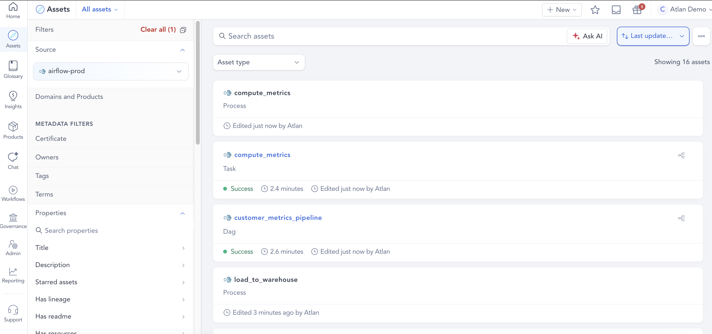
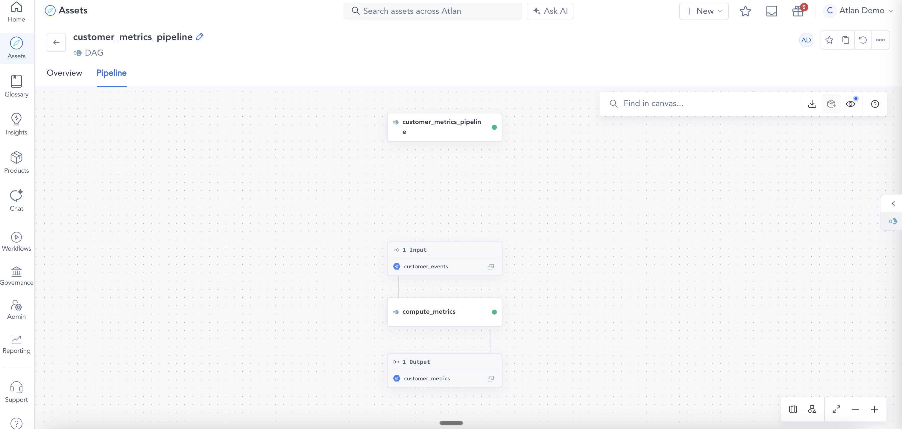
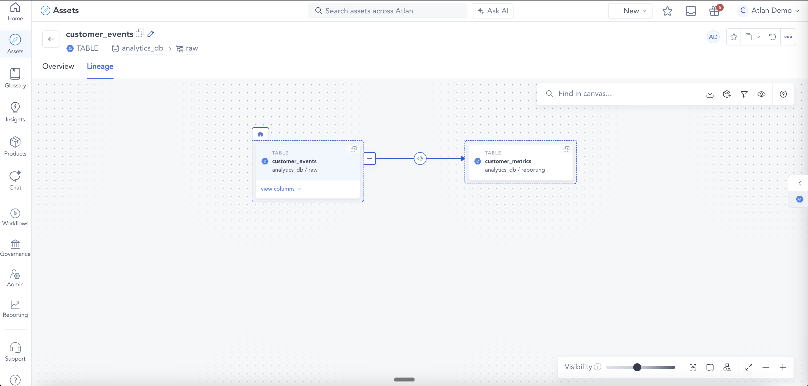
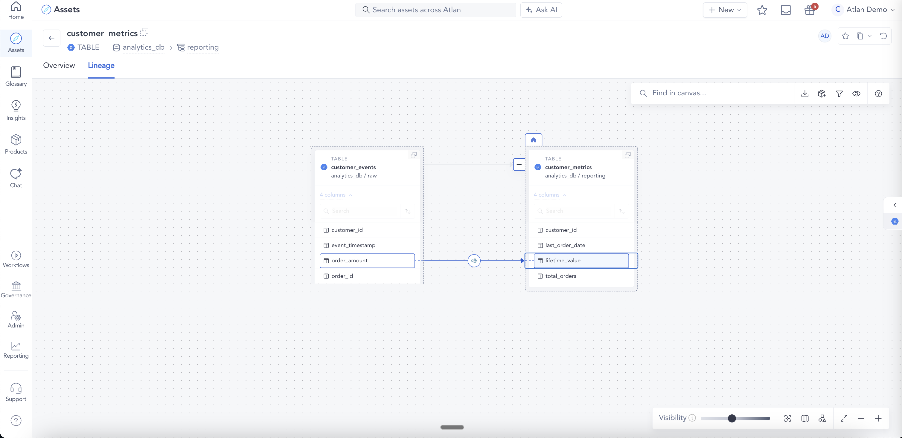

# Example 04: Column-level lineage

Demonstrates the `columnLineage` facet, which creates ColumnProcess assets in Atlan and enables column-level lineage in the UI. A task reads from a BigQuery raw events table and writes to a BigQuery metrics table, mapping input columns to output columns with transformation types.

## What this sends

| File | eventType | Job | Datasets |
|------|-----------|-----|----------|
| `01_dag_start.json` | START | `customer_metrics_pipeline` | — |
| `02_task_start.json` | START | `customer_metrics_pipeline.compute_metrics` | — |
| `03_task_complete.json` | COMPLETE | `customer_metrics_pipeline.compute_metrics` | BigQuery input + BigQuery output with columnLineage |
| `04_dag_complete.json` | COMPLETE | `customer_metrics_pipeline` | — |

## What appears in Atlan

- **1 parent FlowControlOperation**: `customer_metrics_pipeline`
- **1 child FlowControlOperation**: `compute_metrics`
- **1 Process**: linking the two BigQuery tables
- **BigQuery input table** (partial): `analytics_db.raw.customer_events`
- **BigQuery output table** (partial): `analytics_db.reporting.customer_metrics` with columns `customer_id`, `total_orders`, `lifetime_value`, `last_order_date`
- **4 ColumnProcess assets** (one per output column):
  - `customer_id` ← `customer_events.customer_id` (DIRECT / IDENTITY — pass-through)
  - `total_orders` ← `customer_events.order_id` (DIRECT / AGGREGATE — COUNT)
  - `lifetime_value` ← `customer_events.order_amount` (DIRECT / AGGREGATE — SUM)
  - `last_order_date` ← `customer_events.event_timestamp` (DIRECT / AGGREGATE — MAX)

## Key fields

The `columnLineage` facet lives under `outputs[].facets.columnLineage.fields`. Each key is an output column name, and the value lists the input fields it was derived from:

```json
"columnLineage": {
  "fields": {
    "output_column": {
      "inputFields": [
        {
          "namespace": "<input-dataset-namespace>",
          "name": "<input-dataset-name>",
          "field": "<input-column-name>",
          "transformations": [
            { "type": "DIRECT", "subtype": "IDENTITY" }
          ]
        }
      ]
    }
  }
}
```

Transformation types (only `type: "DIRECT"` produces ColumnProcess assets in Atlan):
- `DIRECT / IDENTITY` — column is copied as-is
- `DIRECT / AGGREGATE` — column is computed from an aggregation (COUNT, SUM, MAX, etc.)
- `DIRECT / TRANSFORM` — column is derived via a transformation

Note: `type: "INDIRECT"` entries are silently skipped by the connector and will not produce column lineage, regardless of subtype.

## How it looks in Atlan


*Asset list — DAG, Task, and Process assets created*
<br>


*Pipeline view — customer_metrics_pipeline DAG orchestrating compute_metrics, with customer_events as input and customer_metrics as output*
<br>


*Table lineage — customer_events → customer_metrics via the Process*
<br>


*Column lineage — order_amount (customer_events) mapped to lifetime_value (customer_metrics) via a ColumnProcess*
<br>

## Run it

```bash
python send_events.py examples/04_column_lineage
```
