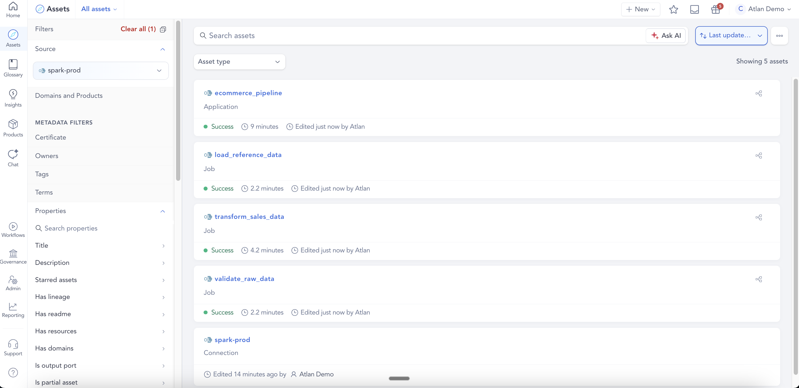
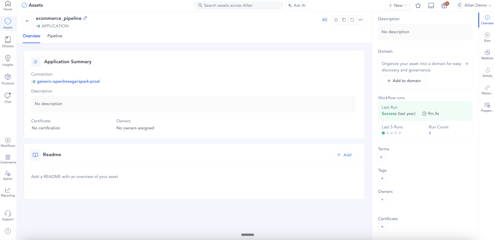
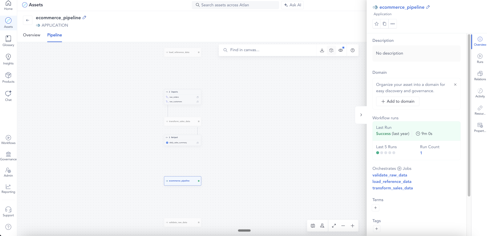
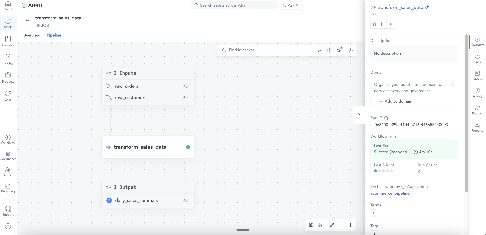

# Example 05: Spark application with multiple jobs

Demonstrates a Spark application with three jobs under one parent FlowControlOperation. Two jobs run without any datasets (validation and reference loading steps), and one job produces table-level lineage: two MySQL tables → a BigQuery table.

## What this sends

| File | eventType | Job | Datasets |
|------|-----------|-----|----------|
| `01_app_start.json` | START | `ecommerce_pipeline` | — |
| `02_job1_start.json` | START | `ecommerce_pipeline.validate_raw_data` | — |
| `03_job1_complete.json` | COMPLETE | `ecommerce_pipeline.validate_raw_data` | — |
| `04_job2_start.json` | START | `ecommerce_pipeline.load_reference_data` | — |
| `05_job2_complete.json` | COMPLETE | `ecommerce_pipeline.load_reference_data` | — |
| `06_job3_start.json` | START | `ecommerce_pipeline.transform_sales_data` | MySQL x2 inputs + BigQuery output |
| `07_job3_complete.json` | COMPLETE | `ecommerce_pipeline.transform_sales_data` | MySQL x2 inputs + BigQuery output |
| `08_app_complete.json` | COMPLETE | `ecommerce_pipeline` | — |

## What appears in Atlan

- **1 parent FlowControlOperation**: `ecommerce_pipeline` (type: Application)
- **3 child FlowControlOperations**: `validate_raw_data`, `load_reference_data`, `transform_sales_data` (type: Job)
- **1 Process**: created for `transform_sales_data` only — the two jobs with no datasets produce no Process
- **MySQL tables** (partial assets): `ecommerce.public.raw_orders`, `ecommerce.public.raw_customers`
- **BigQuery table** (partial asset): `analytics.sales.daily_sales_summary` — with columns `order_date`, `region`, `segment`, `total_orders`, `total_revenue`
- **Lineage edge**: MySQL (x2) → BigQuery via the Process

## Key fields

- `job.facets.jobType.jobType: "APPLICATION"` on the parent event — this is how the connector identifies it as a parent FCO, not a child
- `job.facets.jobType.jobType: "JOB"` on all three child events
- Each child event carries `run.facets.parent` with the application's `runId` and `job.name` — this links them to the parent FCO
- Child `job.name` follows the `parentName.childName` convention (e.g. `ecommerce_pipeline.validate_raw_data`)
- Jobs with no inputs/outputs (`validate_raw_data`, `load_reference_data`) create child FCOs but no Process assets
- `run.facets` is `{}` (empty) on all COMPLETE events — metadata only travels on START
- `outputFacets.outputStatistics` on the COMPLETE event adds `rowCount` and `size` to the output dataset

## How it looks in Atlan


*Asset list — Application and all three Job assets under the spark-prod connection*
<br>


*Application overview — connection, last run status, and run count*
<br>


*Pipeline view — application orchestrating validate_raw_data, load_reference_data, and transform_sales_data*
<br>


*transform_sales_data pipeline — two MySQL inputs (raw_orders, raw_customers) → BigQuery daily_sales_summary*
<br>

## Run it

```bash
python send_events.py examples/05_spark_multi_job
```
