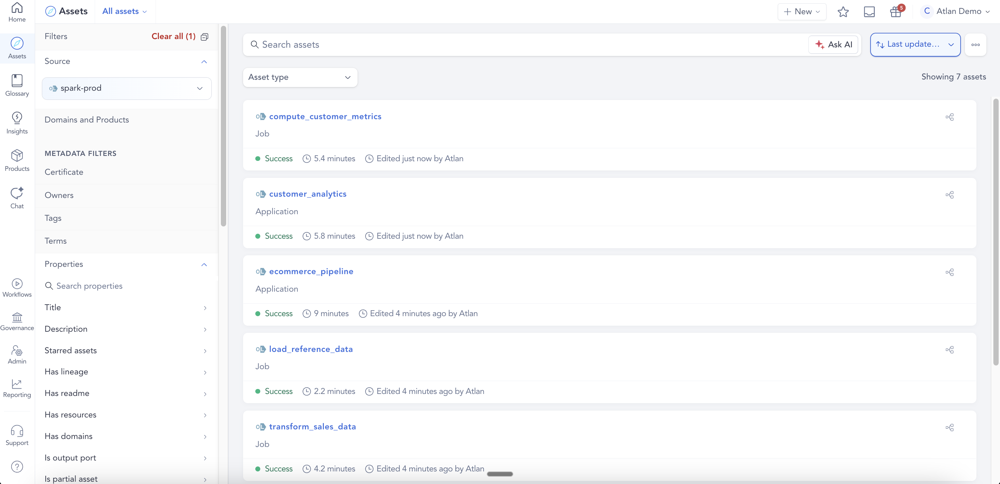
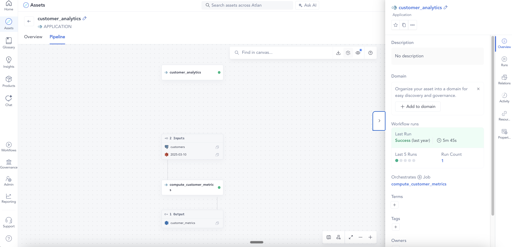
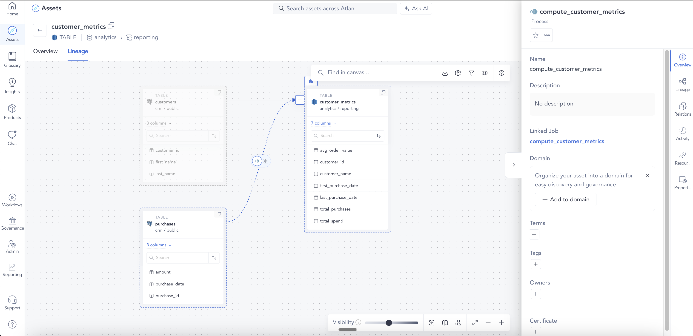
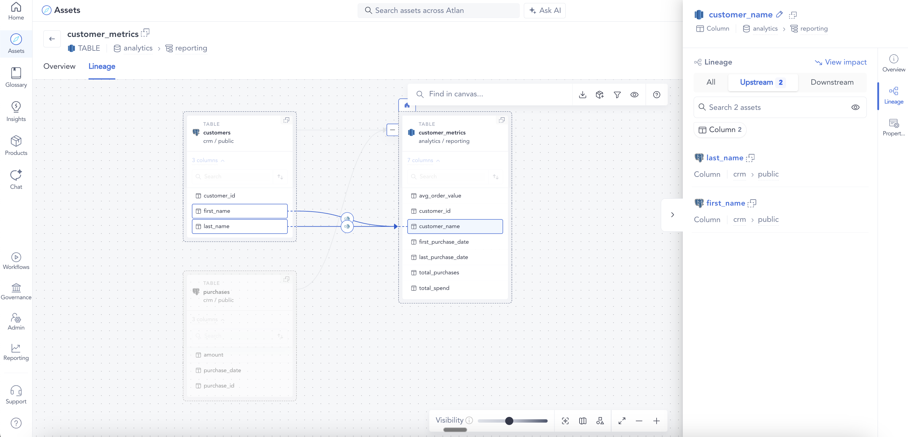
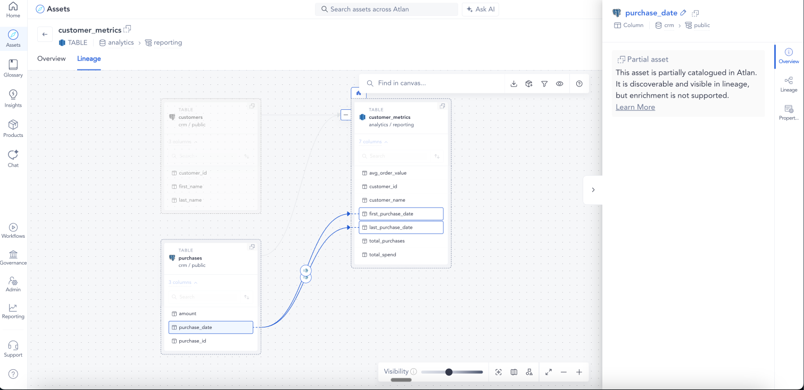

# Example 06: Spark application with column-level lineage

Demonstrates the `columnLineage` facet on a Spark job, creating ColumnProcess assets and enabling column-level lineage in the UI. A single job reads from two PostgreSQL tables (`customers` and `purchases`) and writes to a Redshift table, with column mappings covering both pass-through and multi-input transformations.

## What this sends

| File | eventType | Job | Datasets |
|------|-----------|-----|----------|
| `01_app_start.json` | START | `customer_analytics` | — |
| `02_job_start.json` | START | `customer_analytics.compute_customer_metrics` | PostgreSQL x2 inputs + Redshift output |
| `03_job_complete.json` | COMPLETE | `customer_analytics.compute_customer_metrics` | PostgreSQL x2 inputs + Redshift output with columnLineage |
| `04_app_complete.json` | COMPLETE | `customer_analytics` | — |

## What appears in Atlan

- **1 parent FlowControlOperation**: `customer_analytics` (type: Application)
- **1 child FlowControlOperation**: `compute_customer_metrics` (type: Job)
- **1 Process**: linking both PostgreSQL tables → Redshift
- **PostgreSQL tables** (partial assets): `crm.public.customers`, `crm.public.purchases`
- **Redshift table** (partial asset): `analytics.reporting.customer_metrics` — with columns `customer_id`, `customer_name`, `total_purchases`, `total_spend`, `avg_order_value`, `first_purchase_date`, `last_purchase_date`
- **7 ColumnProcess assets** (one per output column):
  - `customer_id` ← `customers.customer_id` (DIRECT / IDENTITY)
  - `customer_name` ← `customers.first_name` + `customers.last_name` (DIRECT / TRANSFORM — two inputs)
  - `total_purchases` ← `purchases.purchase_id` (DIRECT / AGGREGATE)
  - `total_spend` ← `purchases.amount` (DIRECT / AGGREGATE)
  - `avg_order_value` ← `purchases.amount` (DIRECT / AGGREGATE)
  - `first_purchase_date` ← `purchases.purchase_date` (DIRECT / AGGREGATE)
  - `last_purchase_date` ← `purchases.purchase_date` (DIRECT / AGGREGATE)

## Key fields

- `columnLineage` facet lives under `outputs[].facets.columnLineage.fields` on the COMPLETE event
- Each key is an output column name; the value lists the input fields it was derived from:

```json
"columnLineage": {
  "fields": {
    "output_column": {
      "inputFields": [
        {
          "namespace": "<input-dataset-namespace>",
          "name": "<input-dataset-name>",
          "field": "<input-column-name>",
          "transformations": [
            { "type": "DIRECT", "subtype": "IDENTITY" }
          ]
        }
      ]
    }
  }
}
```

- Only `type: "DIRECT"` transformations produce ColumnProcess assets — `type: "INDIRECT"` is silently skipped by the connector
- Input namespaces must be SQL-based (e.g. `postgresql://`, `snowflake://`, `bigquery`) — non-SQL sources like S3 are skipped for column lineage
- `customer_name` demonstrates a **multi-input** ColumnProcess: two source columns (`first_name`, `last_name`) map to a single output column
- `run.facets` is `{}` (empty) on all COMPLETE events — `columnLineage` goes on the output dataset facet, not the run facet

## How it looks in Atlan


*Asset list — customer_analytics (Application) and compute_customer_metrics (Job) under the spark-pool connection*
<br>


*Application pipeline view — two PostgreSQL inputs flowing through compute_customer_metrics into customer_metrics; right panel shows it orchestrates 1 job*
<br>


*Column lineage canvas — customers and purchases (PostgreSQL) on the left, all 7 customer_metrics columns on the right, compute_customer_metrics Process panel open*
<br>


*customer_name column lineage — upstream panel shows two source columns: first_name and last_name from crm.public.customers*
<br>


*first_purchase_date and last_purchase_date column lineage — both map to purchase_date from crm.public.purchases (partial asset)*
<br>

## Run it

```bash
python send_events.py examples/06_spark_cll
```
